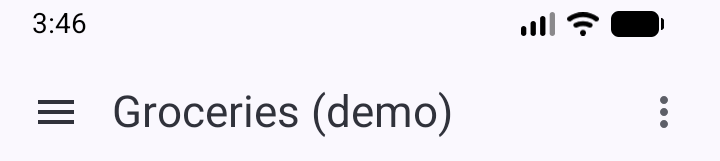
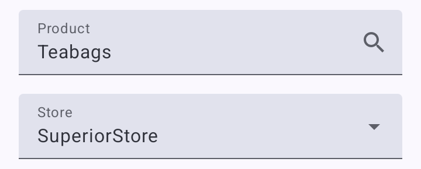

# Overview

This app helps you record prices of products at local stores and compare them. It works entirely offline:
* You enter a list of stores.
* You enter a list of products sold at those stores.
* You enter, update and confirm the prices of those products at those stores as you shop.
* The app shows you the unit price of a product at all the stores which sell it, allowing you to decide where to buy it.

There's nothing particularly fancy or clever here. It's a very simple, specialised database with a user interface optimised for easy use when you're standing in a supermarket aisle with a basket or trolley.

# Getting started

When you first install the app, it will be populated with some demonstration data. This isn't realistic, but it lets you explore the app as it's meant to be used without having to enter a load of data first. Feel free to just play around; it's not as if this data is valuable.

# Collections

You can have as many collections as you like. Each of these is almost like a completely separate database - each collection has its own independent list of stores, products and prices. The demo data is placed in a collection called "Groceries (demo)" to keep it separate.

You can see the collections by tapping on the ☰ ("hamburger menu") at the top left. Tap a collection to make it the current collection. The current collection name is shown at the top of the screen.

When you want to start using the app for real, you will want to create your own collection. Tap on the ⋮ ("three dots menu") at the top right and choose "Edit collections", then use the floating + button at the bottom right to add a new collection. You can also tap on a collection to edit it, and from there you can use the "Delete collection" button to remove it.

# Products and stores

The "Edit products" and "Edit stores" menu options on the three dots menu at the top right allow you to add, edit and delete products and stores *for the current collection*. As with collections, you can add products or stores using the floating + button at the bottom right. You can tap on a product or store to edit it, and from there you can use the "Delete" button to remove it.

The current product and store are shown near the top of the app's main screen:

Tap the "Product" field on the main screen to change the current product. This will open the product selection screen, where you can scroll through the list of products or search by typing in any part of the product name. You can also add new products here using the floating + button at the bottom right of the product selection screen.

Tap the "Store" field on the main screen to change the current store. A menu will open allowing you to pick one. Choosing "None" will mean there is no current store, which hides the "Store price" panel. This might be useful because:
* It frees up space on the screen so you can see more of the "Price comparison" panel.
* It makes it harder to tap the controls on the "Store price" panel by accident.

You can also select a store by tapping on its row in the "Price comparison" panel.

# Design philosophy

Is "design philosophy" a bit pretentious? Sorry, I wasn't sure what else to call it.

Entering all the data yourself obviously means more work than an app using a crowd-sourced database, website scraping or with the app owner curating a database of prices. However, it also means:
* You can trust the data, because you entered it.
* The data reflects the actual local prices and availability. If ValueMart's website shows foozles cost $4/dozen but you live in a city and your local ValueMart is a ValueMart Express which charges a higher price, or doesn't even stock foozles, the app won't mislead you into making a trip to ValueMart to buy your foozles.
* The data reflects how you choose to think about products and your own tastes.

The last point is key. Suppose you drink coffee but aren't brand-sensitive. You might create a product "Ground coffee" and record the price of the best value coffee (regardless of brand) at each store. In the app, you will see all these prices compared together so you can buy the cheapest. There's no need to track each brand separately and categorise them all as "coffee" so you can compare across the different brands. If you're not brand-sensitive but hate ValueMart's own brand coffee, you can just remember that and ignore it when updating the price for "Ground coffee" at ValueMart. You can also write a note within the app if you want to jog your memory the next time you're buying coffee at ValueMart.

On the other hand, suppose you're brand-sensitive when it comes to cereals. You can create separate products for "Jones' Wheaty Flakes" or "Smith's Sugarcorn" and track them separately. When you decide you need to buy a new packet of Jones' Wheaty Flakes, you can see where the cheapest place to buy it is and ignore Smith's Sugarcorn completely.

Either way, there is at most one current price for each combination of store and product.

This is a very simplistic way of representing the price data, but in practice I think it is a good compromise between ease of use and tracking what needs to be tracked. A more advanced data model would allow a better representation of the real world, but it would also require extra effort to navigate and maintain while you're standing in the supermarket aisle.

The app is not intended to allow you to gather an objective and detailed history of prices for everything you buy. Its purpose is to assist you by remembering prices and whether those prices are recent ones or not.

# Settings

The Settings option on the triple dot "overflow" menu at the top right of the home screen brings up the Settings screen. These settings apply to all collections; each collection does not have separate settings.

# Backup and restore

Unless you have some other means of backing up your phone as a whole and have tested it works with this app's data, you are strongly advised to periodically use the Settings->Backup option to export your data to a file *and copy the file off your phone so you don't lose it if your phone is lost, stolen or damaged*.

You can use Settings->Restore to restore a backup created via Settings->Backup. *This will destroy all the data currently held within the app.* The expectation is that if you are restoring a backup, something happened to your phone and you are setting things up fresh with a brand new installation of the app with no real data in yet.

The backup includes all collections, not just the collection you are currently working with. Similarly, restoring a backup removes all existing collections and replaces them with the collections from the backup.

The backup file is just a SQLite database. You can open it with various tools, including web-based SQLite viewers like [SQLite Viewer Web App](https://sqliteviewer.app). If you have privacy concerns, make sure to use a tool you trust and which will not take a copy of your data.

The app is still new and I suggest you perform additional verification of the backups to be safe:
* Keep older copies of the backup file, not just the most recent, and verify that the files are getting larger over time as data accumulates.
* Open the file and see if you can spot recent changes. For example, if you recently added a new product, see if you can see it in the item table.

Although I have not tried to test it myself, I believe that on versions of Android with "Auto Backup for Apps", this app's data may be included in the cloud backup. I have not taken steps to prevent this, since I understand it is opt-in and may be a worthwhile security/privacy trade-off for some people. As this is completely untested, please be very careful before relying on this to keep a useful backup - I strongly suggest you follow the manual backup process described above as well.

# Feedback

Please raise bug reports and suggestions for enhancements as issues at the [app's GitHub repository](https://github.com/ZornsLemma/my-price-log/issues).

This app is open source and is freely available under the MIT license on GitHub.
